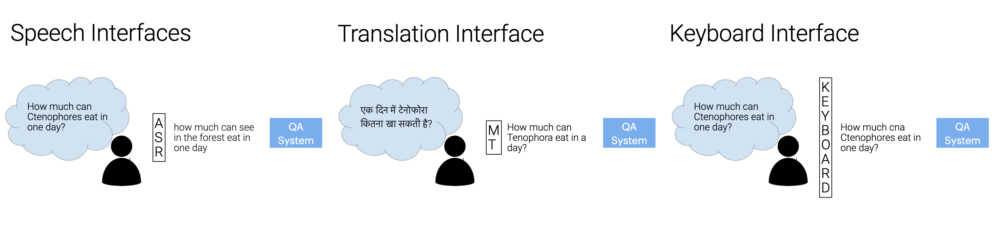

# noiseQA-gen

:wrench: Repository under construction  

# NoiseQA

[NoiseQA](https://noiseqa.github.io/) is a framework for evaluating QA model robustness to interface noise.
We construct synthetic noise generators to simulate three different types of noise faced by QA systems:
 - Machine Translation noise, to simulate errors occurring when users ask questions in a different language than the language(s) the QA model was trained on;
 - Keyboard noise, to simulate the effect of users making spelling errors while typing questions into the QA model;
 - ASR noise, to simulate speech recognition errors occurring when users interact with the QA system through a voice interface. 

For more information on synthetic noise generators, and our constructed datasets, please refer to our paper,
[NoiseQA: Challenge Set Evaluation for User-Centric Question Answering](https://arxiv.org/abs/2102.08345).

The image below shows a parallel example from NoiseQA, where the same question is distorted by the three types of interface noise.




## Reference

If you use our code, please cite [[1]](https://arxiv.org/abs/2102.08345):

[1] Ravichander, A., Dalmia, S., Ryskina, M., Metze, F., Hovy, E., & Black, A. (2021). [NoiseQA: Challenge Set Evaluation for User-Centric Question Answering](https://arxiv.org/abs/2102.08345), EACL 2021.

```
@inproceedings{ravichander2021noiseqa,
  title={{NoiseQA}: Challenge Set Evaluation for User-Centric Question Answering},
  author={Abhilasha Ravichander and Siddharth Dalmia and Maria Ryskina and Florian Metze and Eduard Hovy and Alan W Black},
  booktitle = {Conference of the European Chapter of the Association for Computational Linguistics (EACL)},
  address = {Online},
  month = {April},
  url={https://arxiv.org/abs/2102.08345},
  year={2021}
  }
```

